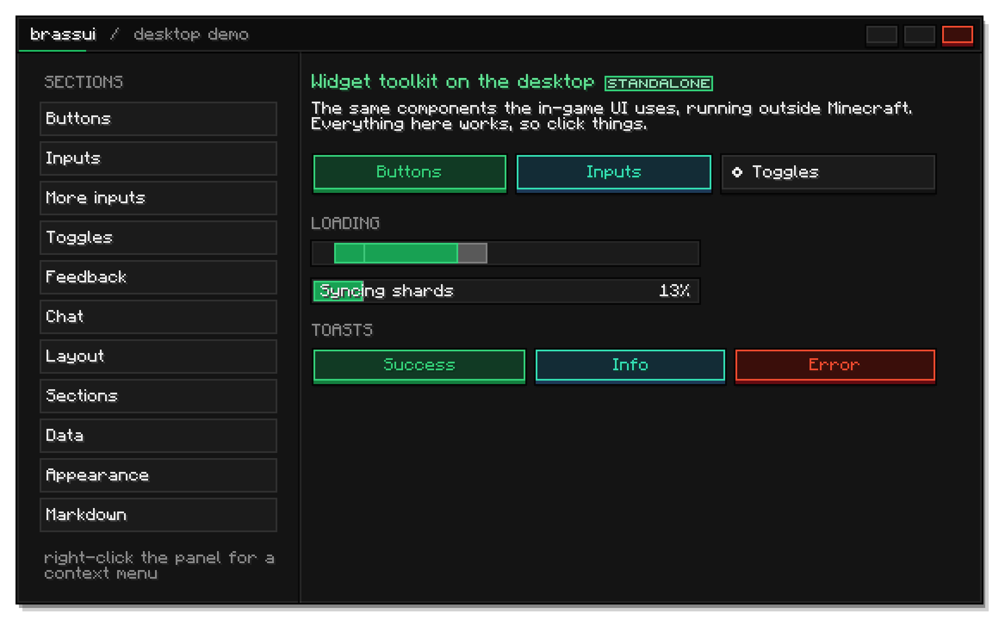
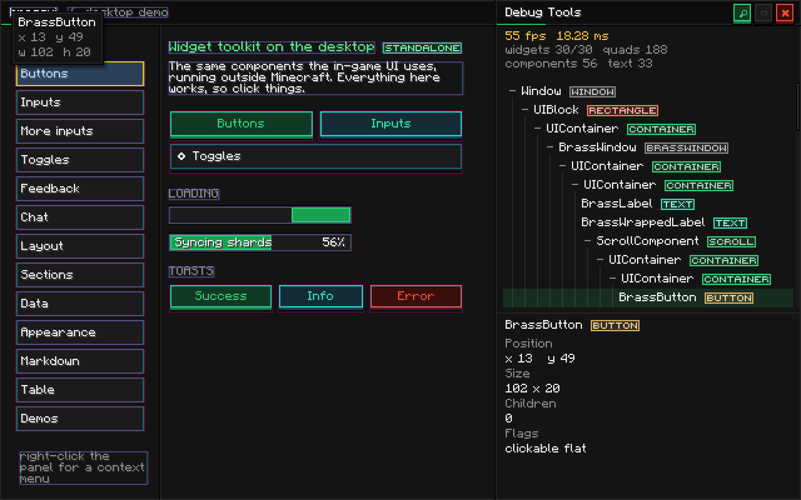
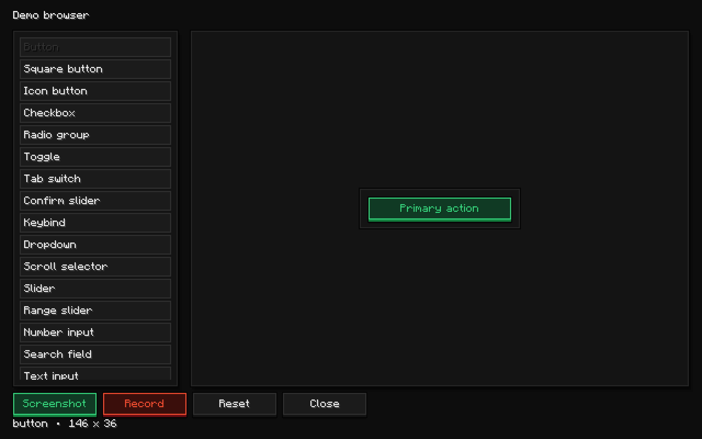

<p align="center">
  
</p>

<h1 align="center">BrassUi</h1>

<p align="center">
  Minecraft screens that don't look like Minecraft screens.
</p>

<p align="center">
  <a href="https://brassworks-smp.github.io/BrassUi/"></a>
  
  
  
</p>

<p align="center">
  
</p>

BrassUi is the widget kit behind the Brassworks launcher, ported into the game. It sits on top of
[Elementa](https://github.com/EssentialGG/Elementa) and gives it a look: raised keycaps on near-black
ink, one brass accent doing all the pointing, cards that never clip their own border, and pages that
wrap instead of overflow. You compose Elementa components, and the kit handles the pixels, the theming,
and the thousand small alignment fights so you don't have to.

The best part is that the same widgets run in two places without a single change: inside Minecraft as a
self-contained NeoForge mod, and on your desktop as a standalone app. Every screenshot in this repo was
captured from the desktop build.

## What it looks like

The toolkit ships with its own dev tools. A layout inspector that reads like a browser's, and a capture
pipeline that produced every image here.

<p align="center">
  
  
</p>

<p align="center"><sub>Left: the layout inspector (Ctrl+Shift+D). Right: the demo browser, where the widget shots come from.</sub></p>

## Highlights

- **89 widgets**, from buttons and sliders to tables, charts, trees, a chat box, a command palette, and inventory grids.
- **One brass accent, themed by role.** No widget stores a colour. It stores the name of a role and asks the live theme every frame, so a theme swap retints everything at once and animates while it does.
- **Layout that wraps by default.** Panels, scroll areas, and a flow container mean a screen reflows instead of overflowing when the window gets tight.
- **Runs off-game.** The core links against no Minecraft classes, so the desktop app runs the real widgets with a native window under them.
- **Built-in dev tools.** A Chrome-style inspector, a demo browser for per-widget captures, and a whole-screen showcase capture that cuts the UI out onto transparency.

## Quick start

BrassUi ships as a self-contained NeoForge mod jar, with Elementa and UniversalCraft folded in, from
GitHub Packages. Add the repository with a token that has `read:packages`, then depend on it:

```kotlin
repositories {
    maven("https://maven.pkg.github.com/Brassworks-smp/BrassUi") {
        credentials {
            username = providers.gradleProperty("gpr.user").orNull ?: System.getenv("GITHUB_ACTOR")
            password = providers.gradleProperty("gpr.token").orNull ?: System.getenv("GITHUB_TOKEN")
        }
        content { includeGroup("net.swzo.brass") }
    }
}

dependencies {
    implementation("net.swzo.brass:brassui:0.1.0")
    jarJar("net.swzo.brass:brassui:0.1.0") { isTransitive = false }
}
```

Then put a screen on the display:

```kotlin
class HelloScreen : BrassScreen() {
    init {
        BrassPanel("HELLO").add(
            BrassLabel("Welcome to BrassUi"),
            BrassButton("Click me", BrassAccent.BRASS) { println("clicked") },
        ).constrain {
            x = CenterConstraint(); y = CenterConstraint(); width = 220.pixels()
        } childOf background
    }
}

Minecraft.getInstance().setScreen(HelloScreen())
```

Already running the mod? Open the live gallery in game with `/brassui`.

## Documentation

The full wiki lives at **[brassworks-smp.github.io/BrassUi](https://brassworks-smp.github.io/BrassUi/)**:

- [Getting started](https://brassworks-smp.github.io/BrassUi/#/getting-started) walks the first screen end to end.
- [Using Elementa](https://brassworks-smp.github.io/BrassUi/#/elementa) covers components, constraints, drawing, events, and where it runs.
- [All widgets](https://brassworks-smp.github.io/BrassUi/#/widgets) has a page per widget with usage and parameters.
- [Dev tools](https://brassworks-smp.github.io/BrassUi/#/dev-tools) explains the inspector and the capture tools.

## Building from source

```bash
./gradlew build            # build every module
./gradlew :desktop:run     # launch the standalone desktop gallery
```

The desktop launcher is wrapped by `launcher/`, a small Rust program that bakes the app jar into a
native executable, finds or downloads a JRE, and runs it, so a user can double-click one file whether
or not they have Java installed.

## License

Source-available under the [PolyForm Noncommercial License 1.0.0](LICENSE.md). Noncommercial use is
granted; commercial use by anyone else is not.
