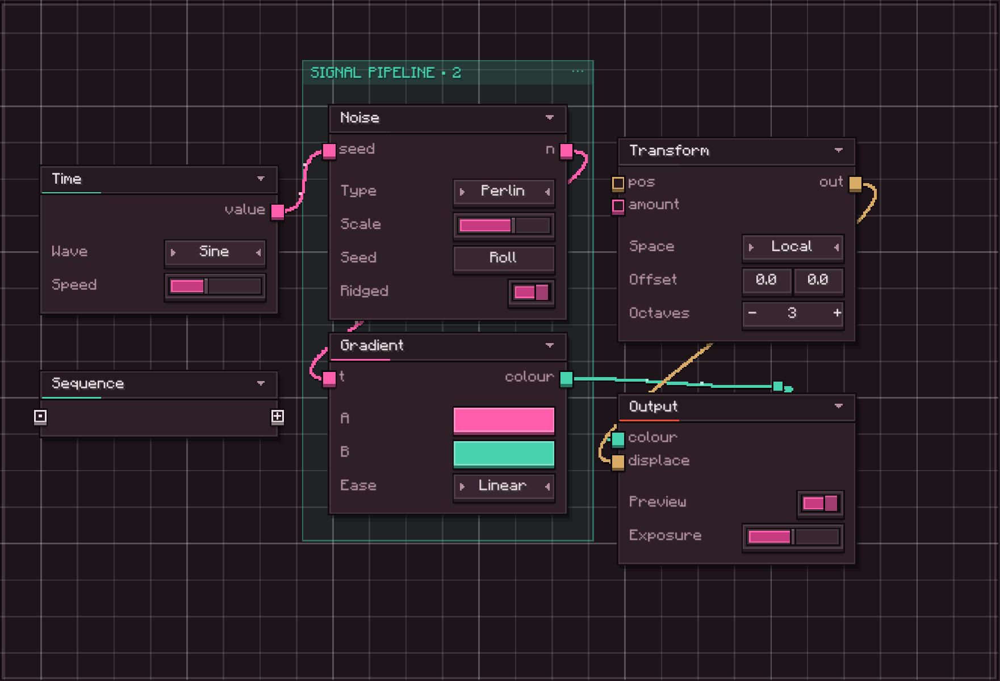
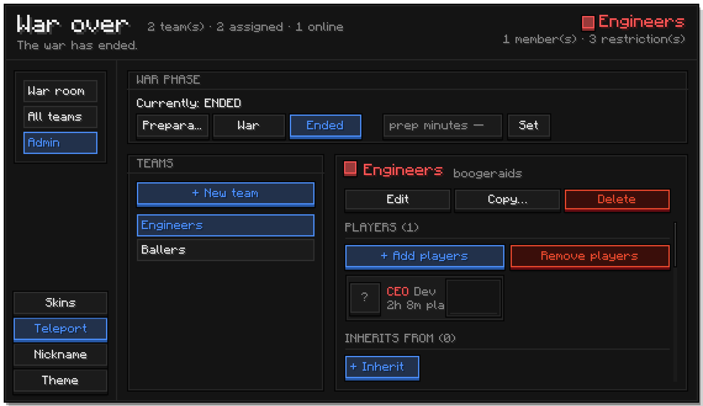
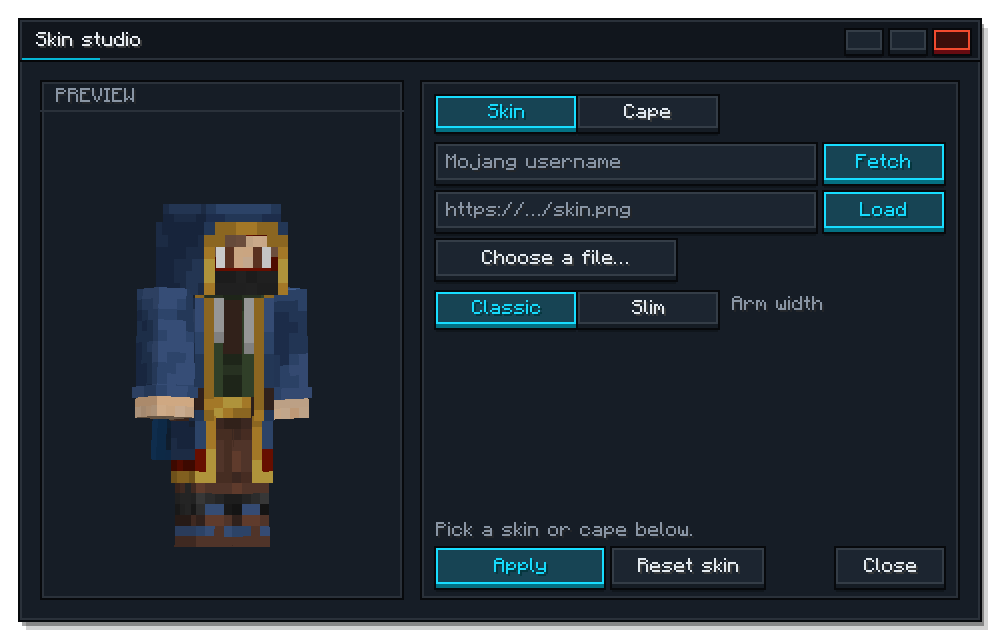
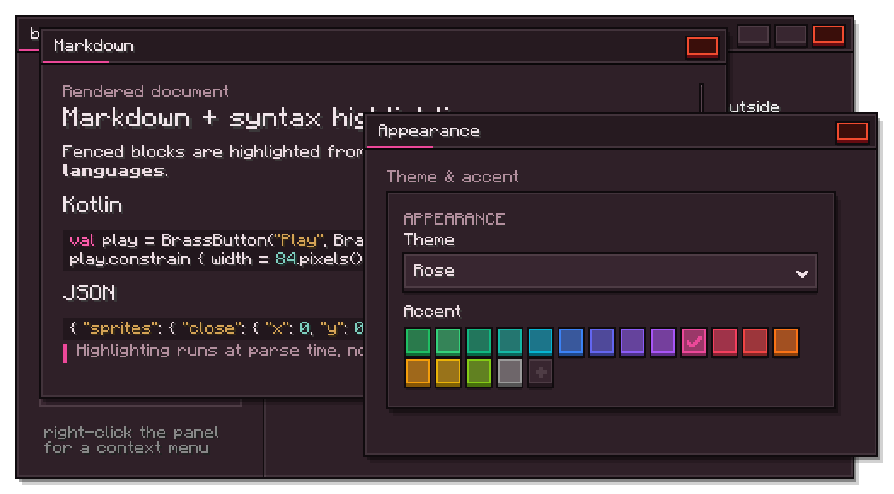
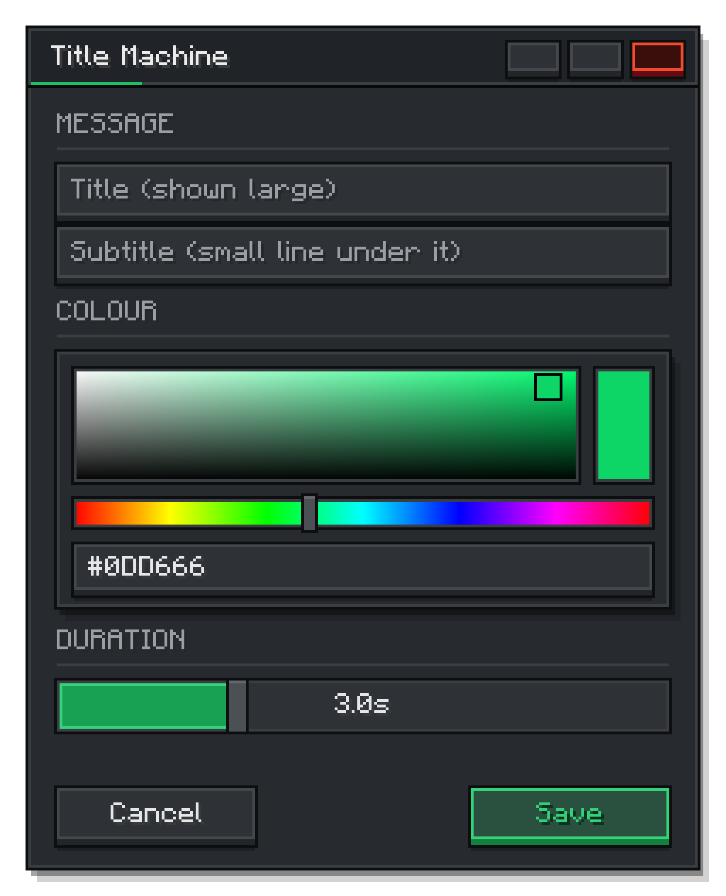
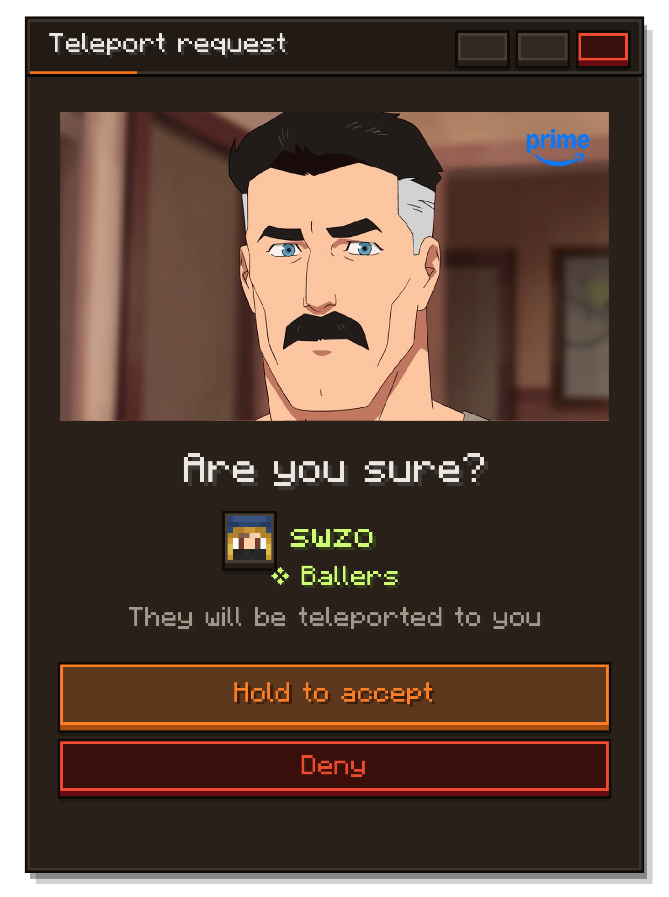

<p align="center">
  
</p>

<h1 align="center">BrassUi</h1>

<p align="center">
  Minecraft screens that don't look like Minecraft screens.
</p>

<p align="center">
  <a href="https://brassworks-smp.github.io/BrassUi/"></a>
  
  
  
</p>

<p align="center">
  
</p>

BrassUi is the widget kit behind the Brassworks launcher, ported into the game. It sits on top of
[Elementa](https://github.com/EssentialGG/Elementa) and gives it a look: raised keycaps on near-black
ink, one brass accent doing all the pointing, cards that never clip their own border, and pages that
wrap instead of overflow. You compose Elementa components, and the kit handles the pixels, the theming,
and the thousand small alignment fights so you don't have to.

The best part is that the same widgets run in two places without a single change: inside Minecraft as a
self-contained NeoForge mod, and on your desktop as a standalone app. Every screenshot in this repo was
captured from the desktop build.

## What it looks like

The toolkit ships with its own dev tools. A layout inspector that reads like a browser's, and a capture
pipeline that produced every image here.

<p align="center">
  
  
</p>

<p align="center"><sub>Left: the layout inspector (Ctrl+Shift+D). Right: the demo browser, where the widget shots come from.</sub></p>

## Showcase

<p align="center">
  <a href="https://brassworks-smp.github.io/BrassUi/#/node-editor">
    
  </a>
</p>

<p align="center"><sub>The node editor: typed graphs, animated inline controls, reroutable wires, notes, groups, execution and debugging.</sub></p>

<p align="center">
  
</p>

<p align="center">
  
  
</p>

<p align="center">
  
  
</p>

## Highlights

- **89 widgets**, from buttons and sliders to tables, charts, trees, a chat box, a command palette, and inventory grids.
- **One brass accent, themed by role.** No widget stores a colour. It stores the name of a role and asks the live theme every frame, so a theme swap retints everything at once and animates while it does.
- **Layout that wraps by default.** Panels, scroll areas, and a flow container mean a screen reflows instead of overflowing when the window gets tight.
- **A complete node editor.** Typed ports and reroutable wires, animated fields, notes and nested groups, undo/redo, templates, BSON native save/load with JSON/SVG export, execution, debugging, plugins, and collaboration.
- **UI → server logic, no registration.** Actions are declared inline beside a screen and run on the
  server automatically: the same single jar discovers them on the client and on a dedicated server,
  serializes them as BSON (MongoDB's binary format, bundled jar-in-jar), authorizes them by op level, rate-limits them, and pushes state changes
  back to every subscribed screen. No packets, no codecs, no `register` calls.
- **Runs off-game.** The core links against no Minecraft classes, so the desktop app runs the real widgets with a native window under them.
- **Built-in dev tools.** A Chrome-style inspector, a demo browser for per-widget captures, and a whole-screen showcase capture that cuts the UI out onto transparency.

## Networking

UI actions are the one part of a mod that used to mean writing packet classes, a registry, an
authorization check and a state-sync path by hand. In BrassUi they are one object per file, declared
inline next to the screen that uses them:

```kotlin
@BrassActionSet
object TeamActions {
    val rename = brassAction<RenameTeam>(
        id = "brassui.team.rename",
        permission = "brassui.team.rename",
        minOpLevel = 3,
    ) { ctx, input ->
        Teams.get(input.teamId)?.name = input.name
        ctx.publish("brassui.team.name", input.name)
        ok()
    }
}

// in the screen:
actionButton("Rename", TeamActions.rename) {
    RenameTeam(teamId, field.text)
}
```

The mod discovers `@BrassActionSet` objects on its own — via FML scan data in game, the classpath on
the desktop — on **both** the client and a dedicated server, so one jar covers the whole round trip:
the action is serialized as BSON (MongoDB's binary format, no codecs to write), authorized by the declared op level before the
handler runs, rate-limited when asked, and its failures come back as toasts with the button
automatically disabled while it is in flight. `brassValue(...)` gives you server-pushed state with
snapshot-on-subscribe: set `.value` in a handler and every open screen bound to that id updates.

The module goes further out of the box: **async handlers** (`brassAsyncAction`) keep slow work off the
server thread, **permission sync** makes button state reflect the server's real decisions (PermissionAPI
included), **optimistic updates** reconcile against authoritative pushes, **coalesced values** throttle
high-frequency state, **targeted publishes** reach one player, protocol versioning rejects mixed
client/server versions with a `version.mismatch` error, payloads gzip-compress past 256 bytes, disconnects fail
in-flight requests cleanly, and an audit hook logs every executed action. `/brassui action <id> <json>`
fires any action from chat for testing. Errors translate through Minecraft's language system in game,
with a built-in catalog and host-side overrides on every platform.

See it live in the gallery's **Networking** section (`/brassui` in game, or the desktop app) — the
same screen and the same action set run against the in-game server and in-process on the desktop.
Desktop identity is configurable for testing the authorization mirror:
`-Dbrassui.net.user=Steve -Dbrassui.net.op=4`.

## Quick start

BrassUi ships as a self-contained NeoForge mod jar, with Elementa and UniversalCraft bundled in, from
the Brassworks SMP Maven repository — Elementa and UniversalCraft are mirrored there too, so one
repository and one line pull the whole toolkit. Add it and depend on the mod—no download token
required:

```kotlin
repositories {
    maven("https://maven.opnsoc.org/releases")
    mavenCentral()
}

dependencies {
    implementation(jarJar("net.swzo.brass:brassui:2.1.0") {})
}
```

Then put a screen on the display:

```kotlin
class HelloScreen : BrassScreen() {
    init {
        BrassPanel("HELLO").add(
            BrassLabel("Welcome to BrassUi"),
            BrassButton("Click me", BrassAccent.BRASS) { println("clicked") },
        ).constrain {
            x = CenterConstraint(); y = CenterConstraint(); width = 220.pixels()
        } childOf background
    }
}

Minecraft.getInstance().setScreen(HelloScreen())
```

Already running the mod? Open the live gallery in game with `/brassui`.

## Documentation

The full wiki lives at **[brassworks-smp.github.io/BrassUi](https://brassworks-smp.github.io/BrassUi/)**:

- [Getting started](https://brassworks-smp.github.io/BrassUi/#/getting-started) walks the first screen end to end.
- [Using Elementa](https://brassworks-smp.github.io/BrassUi/#/elementa) covers components, constraints, drawing, events, and where it runs.
- [All widgets](https://brassworks-smp.github.io/BrassUi/#/widgets) has a page per widget with usage and parameters.
- [Node editor](https://brassworks-smp.github.io/BrassUi/#/node-editor) documents its features, interaction model, runtime, extension APIs, persistence, collaboration, and architecture.
- [Dev tools](https://brassworks-smp.github.io/BrassUi/#/dev-tools) explains the inspector and the capture tools.

## Building from source

```bash
./gradlew build            # build every module
./gradlew :desktop:run     # launch the standalone desktop gallery
```

## Publishing

`./gradlew publish` uploads the two publishable artifacts — `brassui-core` (the toolkit library) and
`brassui` (the self-contained NeoForge mod) — to `https://maven.opnsoc.org/releases`. Reading from
that repository is public; publishing requires a key.

Publishing credentials live in the gitignored `.env` at the repo root (copy `.env.example`):

```bash
BRASSWORKS_MAVEN_USER=brassui
BRASSWORKS_MAVEN_KEY=<your key>
```

`build.gradle` reads the file directly, so a release is one command — no `source .env` needed. Real
environment variables or `-P` properties override the file when set. The version comes from
`gradle.properties` (single source of truth); the repository does not allow overwriting a published
version, so bump it before each release.

The desktop launcher is wrapped by `launcher/`, a small Rust program that bakes the app jar into a
native executable, finds or downloads a JRE, and runs it, so a user can double-click one file whether
or not they have Java installed.

## License

Source-available under the [PolyForm Noncommercial License 1.0.0](LICENSE.md). Noncommercial use is
granted; commercial use by anyone other than the copyright holder requires a separate commercial
license. The copyright holder retains the right to use BrassUi commercially and offer it under
additional license terms.
